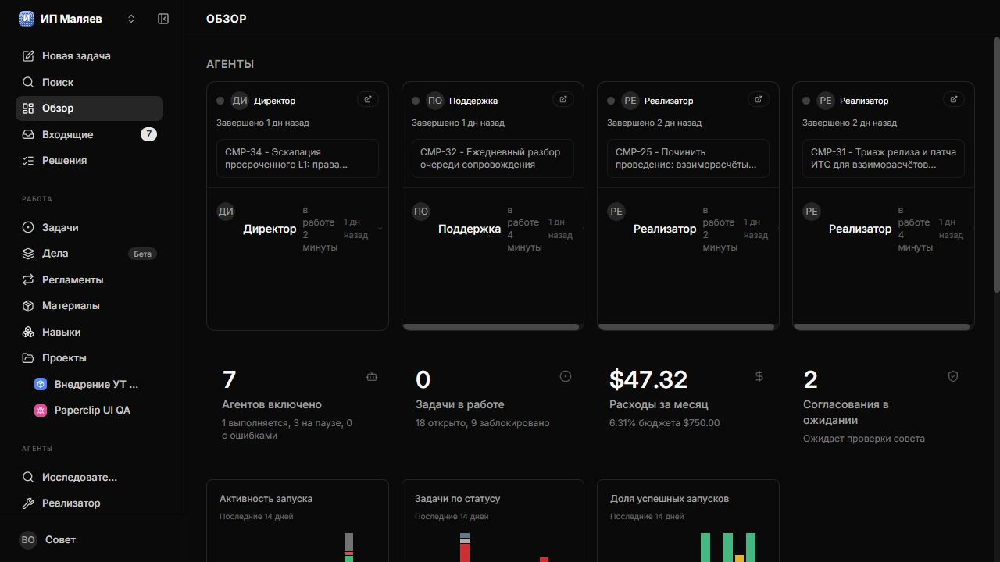
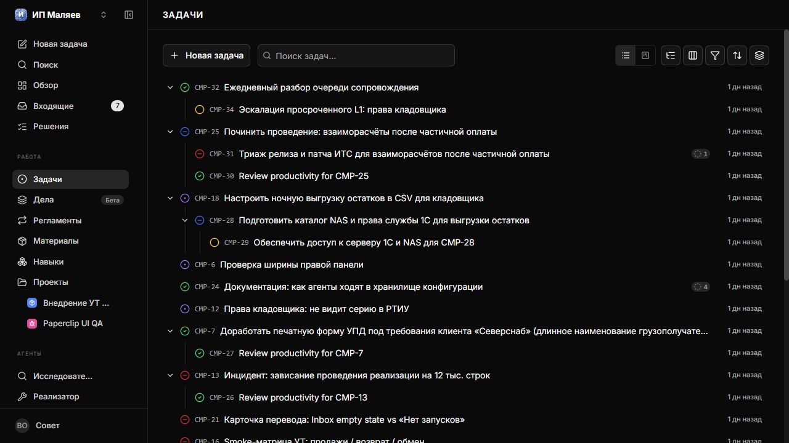
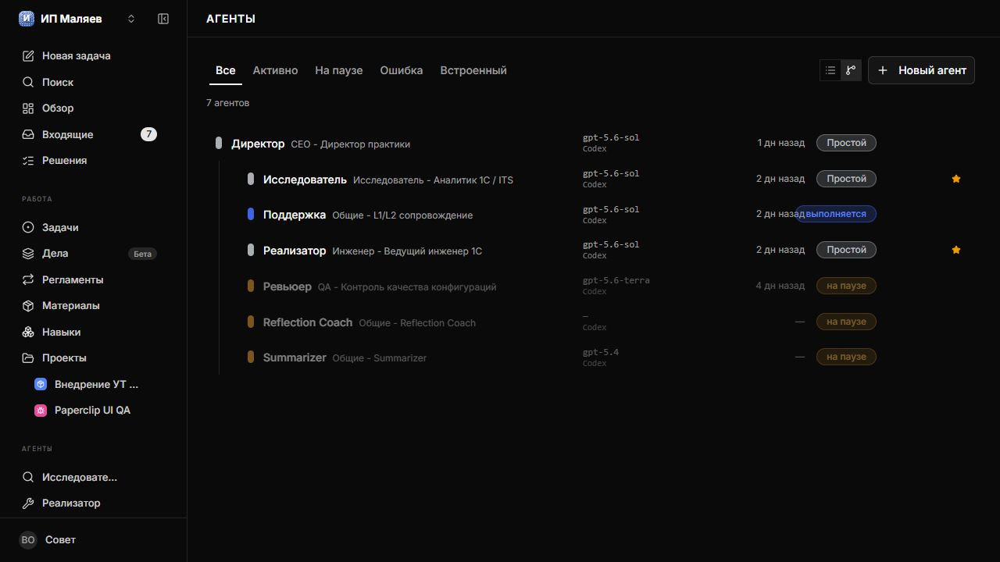
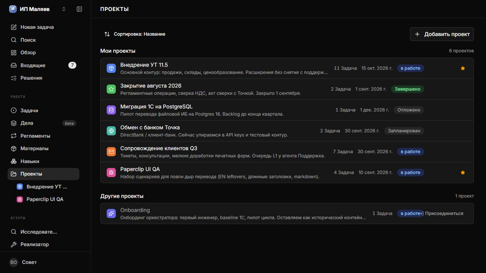
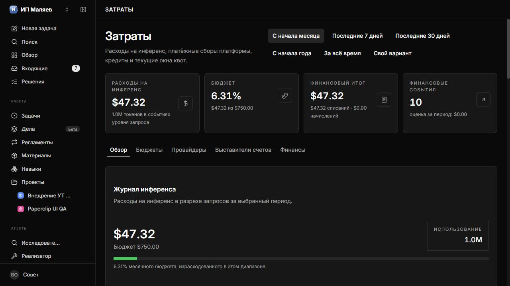
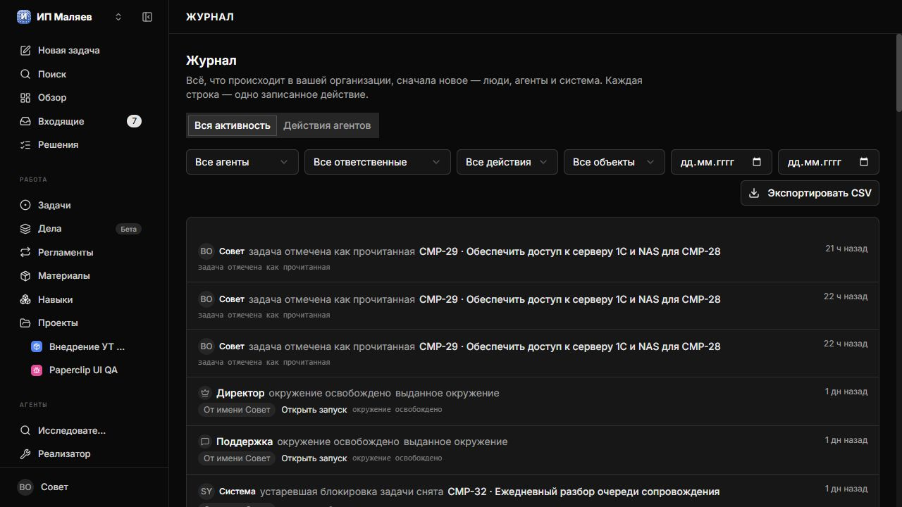
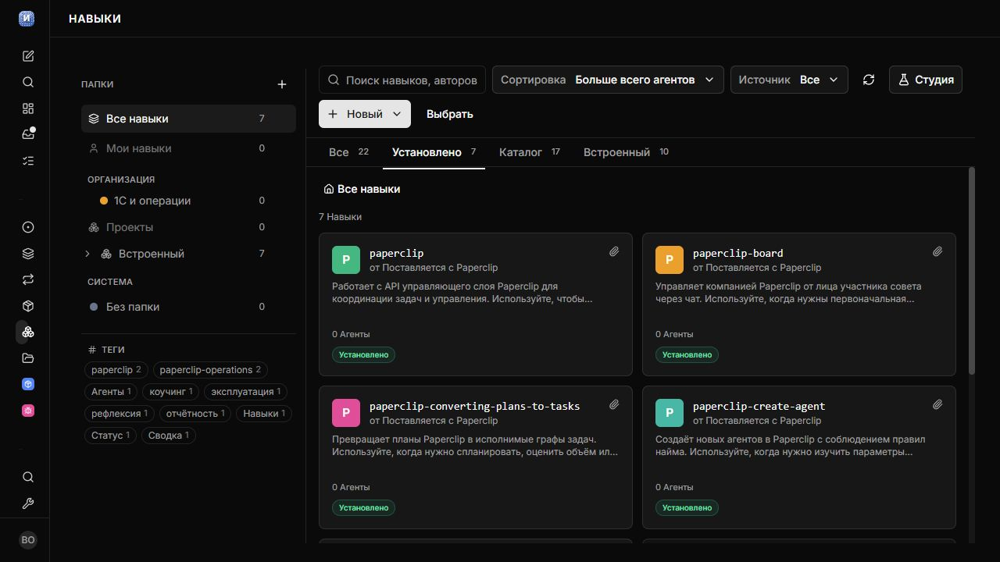

# paperclip-ru

[Русский README](README.md)

Unofficial Russian localization for official npm builds of
[Paperclip](https://github.com/paperclipai/paperclip) (`paperclipai`).
**This is not an official Paperclip product or a source fork.**

The tool translates the supported operator interface. User and technical content
stays in its original language.

## Translation boundaries

Translated: navigation, headings, buttons, tooltips, placeholders, accessibility
labels, system messages, activity event names, dates, numbers, relative time and
Russian plural forms.

Preserved: agent instructions and system prompts; the contents of `AGENTS.md`,
`SOUL.md`, `HEARTBEAT.md` and `TOOLS.md`; user names, tasks, comments, documents and
Markdown; code, commands, paths, JSON/YAML/TOML; identifiers, enums, API routes,
CSS classes, storage keys, brands and model names.

## Requirements

| Component | Requirement |
| --- | --- |
| OS | Windows and Linux; macOS is experimental |
| Node for this tool | 20+ |
| Node for current Paperclip | 24.11+ (upstream requirement) |
| Paperclip | Every verified stable release from the last 30 days; see the exact compatibility matrix. Canary, nightly and commit builds are unsupported |

See the [compatibility matrix](docs/COMPATIBILITY.md) for exact versions and test scope.

Paperclip **2026.1001.0** requires **paperclip-ru v1.0.3** or later. This release
adds Russian UI text for routine webhooks, GitHub review bots, Slack onboarding
and the new MCP connection setup flows.

Support for Paperclip 2026.916.1 and 2026.916.0 is included in paperclip-ru
**v1.0.1** and later. Install this or a newer
[stable release](https://github.com/maljaev-alex/paperclip-ru/releases/latest)
for these September versions.

## Install from GitHub Release

1. Download `paperclip-ru-<version>.zip` or `.tar.gz`, `release-manifest.json` and `SHA256SUMS` from a stable GitHub Release.
2. Verify the archive SHA-256 before extraction.
3. Extract into a temporary bootstrap directory, separate from the final installation.
4. Inside the extracted `paperclip-ru/`, run `npm ci --omit=dev` using the lockfile. Version 1 does not include bundled dependencies.
5. Run the installer below. It verifies the release, installs runtime dependencies in the destination, then runs doctor, dry-run, apply and verify.

Windows PowerShell:

```powershell
Get-FileHash .\paperclip-ru-1.0.3.zip -Algorithm SHA256
# Compare with the matching line in SHA256SUMS before extraction.
# Run from the verified bootstrap directory:
.\scripts\install.ps1 -Version 1.0.3 -SourceDir "<distDir>" -NonInteractive -Json -ServerDir "<serverDir>"
```

POSIX:

```bash
grep " paperclip-ru-1.0.3.tar.gz$" SHA256SUMS | sha256sum -c -
# Run from the verified bootstrap directory:
./scripts/install.sh --version 1.0.3 --source-dir "$dist_dir" --non-interactive --json --server-dir "$server_dir"
```

The default installation is `%LOCALAPPDATA%\paperclip-ru` on Windows and
`${XDG_DATA_HOME:-$HOME/.local/share}/paperclip-ru` on POSIX. The final executable
is `<installDir>/tools/paperclip-ru.mjs`. `--source-dir` points to the directory
containing the verified archive, manifest and checksums. Without `--source-dir`,
the bootstrap selects a published stable release from the configured repository.

The complete unattended lifecycle is documented in [AGENTS.md](AGENTS.md).
Do not use `curl | sh` or `irm | iex`. This package is not published to npm.

## Use from source

```bash
git clone https://github.com/maljaev-alex/paperclip-ru.git
cd paperclip-ru
npm ci
node tools/paperclip-ru.mjs doctor --json
node tools/paperclip-ru.mjs apply --dry-run --json
node tools/paperclip-ru.mjs apply --json
node tools/paperclip-ru.mjs verify --json
```

A source checkout can apply and revert the translation directly. Managed
`update` and `uninstall` require the ownership marker created by `install`.

## Develop and contribute

The GitHub Release ZIP and TAR.GZ are contributor-ready snapshots, not reduced
runtime bundles. They include every permitted tracked file: runtime code,
translation layers, development tools, tests, fixtures, documentation and CI.

```bash
npm ci
npm run build
npm run lint
npm run test:unit
npm run test:integration
npm run test:e2e
```

Start with [CONTRIBUTING.md](CONTRIBUTING.md), the folder-specific README files
and [docs/TESTING.md](docs/TESTING.md). Generated dependencies, workspaces,
translation chunks, review reports and previous builds are deliberately absent.

## Commands

| Command | Purpose |
| --- | --- |
| `doctor [--json]` | Check Node, discovery, permissions, baseline and compatibility |
| `status [--json]` | Inspect the current localization state |
| `verify [--json]` | Verify hashes, overlay, dictionary and postconditions |
| `apply [--dry-run]` | Apply localization |
| `reapply [--dry-run]` | Apply after a Paperclip or dictionary update |
| `revert [--dry-run]` | Restore the original bytes |
| `extract [--output <path>]` | Extract candidate strings |
| `report [--output <path>]` | Report status and classified coverage |
| `install [--release-version <version>] [--source-dir <path>]` | Verify and install an owned release |
| `update [--release-version <version>] [--source-dir <path>]` | Update with automatic transaction rollback |
| `uninstall [--install-dir <path>]` | Revert and remove an owned installation |

`--server-dir` overrides `PAPERCLIP_SERVER_DIR` and autodiscovery. Panel resizing
is optional and off on a clean installation; enable it with `--with-panel-resize`.
Subsequent `apply` / `reapply` commands preserve the choice in the manifest when
neither flag is supplied. Use `--without-panel-resize` to disable it explicitly.

Exit codes: 0 success, 1 execution error, 2 invalid arguments, 3 Paperclip not
found, 4 unsupported build, 5 hash conflict, 6 insufficient permissions.
Read-only commands and dry runs do not create files or use the network.

After apply, hard-reload the UI with Ctrl+F5 or Cmd+Shift+R. The tool does not
restart Paperclip.

## Baseline and recovery

Original files are stored in `ui-dist/.paperclip-ru/baseline/`. Revert verifies
the patched files before restoring the originals byte for byte. Keep the baseline.
A Paperclip update replaces `ui-dist`; use `reapply` to establish a baseline for
the supported new build.

Interrupted operations resume only when journal hashes and snapshots prove the
rollback. External edits stop recovery without overwriting them. See
[Troubleshooting](docs/TROUBLESHOOTING.md).

## Report an untranslated string

Use the Translation issue template. Include the Paperclip version, route, exact
English text and a screenshot with private data removed.

## Known limitations

- Compatibility depends on the internal bundle structure. Unknown fingerprints or changed AST signatures cause a controlled refusal.
- Editor contents and user names remain unchanged; the editor's interface is translated.
- The upstream `/design-guide` component catalogue is excluded from the operator route matrix.
- Extraction candidates include library text. Their count does not measure untranslated UI.
- macOS has an experimental CI job; it is not part of the validated Windows/Linux release claim.
- Paperclip 2026.817.0 is best-effort because its unmodified frontend calls a
  missing `built-in-agents` endpoint; see the compatibility matrix.

## Screenshots

Local Paperclip demonstration instance with the Russian overlay and dark theme:



| Issues | Agents |
| --- | --- |
|  |  |

| Projects | Costs |
| --- | --- |
|  |  |

| Activity | Skills |
| --- | --- |
|  |  |

## Repository and security

Source: [maljaev-alex/paperclip-ru](https://github.com/maljaev-alex/paperclip-ru).
Vulnerabilities: [SECURITY.md](SECURITY.md). Distribution uses GitHub Release
archives and checksums. Both archive formats contain the same tracked source
snapshot plus `artifact-manifest.json`. The package remains `private: true`.

## License

MIT. See [LICENSE](LICENSE).
